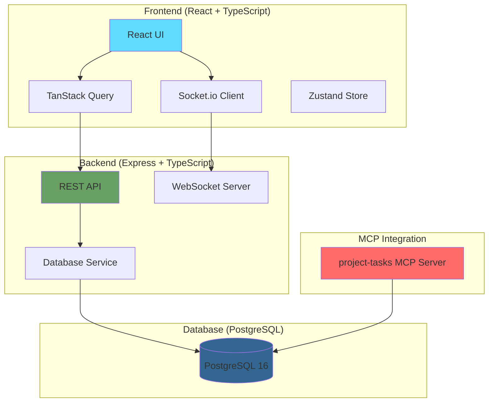

# 🚀 ProjectHub-MCP

[](https://opensource.org/licenses/MIT)
[](https://reactjs.org/)
[](https://www.typescriptlang.org/)
[](https://nodejs.org/)
[](https://www.postgresql.org/)
[](https://www.docker.com/)
[](https://github.com/anubissbe/ProjectHub-Mcp)

> 🎯 A modern, feature-rich project management system with real-time collaboration, advanced analytics, and seamless MCP (Model Context Protocol) integration

## 📊 Project Status

🚀 **Status**: Production Ready  
📊 **Scale**: Handles hundreds of tasks and multiple projects  
🔧 **Architecture**: Microservices with Docker deployment

## 🎯 Overview

ProjectHub-MCP is a comprehensive project and task management system built specifically for the MCP-Enhanced Workspace. It provides a modern web interface for managing projects and tasks stored in PostgreSQL, with real-time updates, advanced analytics, and seamless integration with the project-tasks MCP server.

### ✨ Key Features

- **📋 Project Management**: Full CRUD operations with status tracking (planning, active, paused, completed, cancelled)
- **✅ Task Management**: Create, update, and track tasks with priorities, time estimates, and dependencies
- **📊 Kanban Board**: Drag-and-drop interface with real-time updates via WebSocket
- **📈 Analytics Dashboard**: Comprehensive charts for project progress, task distribution, and team productivity
- **⏱️ Pomodoro Timer**: Built-in time tracking with work/break intervals
- **📅 Calendar View**: Visualize tasks and deadlines in a calendar format
- **📱 Responsive Design**: Optimized for desktop, tablet, and mobile devices
- **🌓 Dark Mode**: Full dark/light theme support with persistence
- **🔄 Real-time Updates**: WebSocket integration for live collaboration
- **📤 Export Functionality**: Export tasks and reports in various formats
- **🔍 Advanced Search**: Filter and search tasks across all projects

## 🏗️ Architecture



## 🚀 Quick Start

### Prerequisites

- Docker and Docker Compose
- Node.js 18+ (for local development)
- PostgreSQL 16 (or access to remote instance)
- Git

### 🐳 Docker Deployment (Recommended)

```bash
# 1. Clone the repository
git clone https://github.com/anubissbe/ProjectHub-Mcp.git
cd ProjectHub-Mcp

# 2. Configure environment
cp .env.example .env
# Edit .env with your database credentials

# 3. Start all services
docker-compose up -d

# 4. Access the application
# Frontend: http://localhost:5173
# Backend API: http://localhost:3001/api
```

### 🛠️ Local Development

```bash
# Install dependencies
npm install
cd frontend && npm install
cd ../backend && npm install

# Set up environment variables
cp .env.example .env
# Edit .env file

# Start development servers
# Terminal 1 - Backend
cd backend && npm run dev

# Terminal 2 - Frontend
cd frontend && npm run dev
```

## ⚙️ Configuration

### Required Environment Variables

Create a `.env` file in the root directory:

```bash
# Database Configuration
DATABASE_URL=postgresql://[username]:[password]@[host]:[port]/[database]
POSTGRES_HOST=your-postgres-host
POSTGRES_PORT=5432
POSTGRES_USER=your-username
POSTGRES_PASSWORD=your-password
POSTGRES_DB=your-database

# Application Configuration
NODE_ENV=production
PORT=3001
FRONTEND_URL=http://localhost:5173

# WebSocket Configuration
WEBSOCKET_ENABLED=true
```

## 📁 Project Structure

```
ProjectHub-Mcp/
├── backend/                # Express.js backend
│   ├── src/
│   │   ├── routes/        # API routes
│   │   ├── services/      # Business logic
│   │   ├── models/        # Data models
│   │   ├── middleware/    # Express middleware
│   │   └── app.ts         # Application entry
│   └── package.json
├── frontend/              # React frontend
│   ├── src/
│   │   ├── components/    # React components
│   │   ├── pages/         # Page components
│   │   ├── hooks/         # Custom hooks
│   │   ├── stores/        # Zustand stores
│   │   └── App.tsx        # Main application
│   └── package.json
├── docs/                  # Documentation
├── tests/                 # Test suites
├── docker-compose.yml     # Docker orchestration
└── README.md             # This file
```

## 🔧 Technology Stack

### Frontend
- **React 19.1.0** - UI framework
- **TypeScript 5.0** - Type safety
- **Vite** - Build tool and dev server
- **Tailwind CSS** - Utility-first styling
- **TanStack Query v5** - Data fetching and caching
- **React Router v7** - Client-side routing
- **Zustand** - State management
- **Recharts** - Data visualization
- **Socket.io-client** - Real-time updates

### Backend
- **Node.js 18+** - Runtime environment
- **Express.js 4.18** - Web framework
- **TypeScript** - Type safety
- **PostgreSQL 16** - Primary database
- **Socket.io** - WebSocket server
- **Zod** - Schema validation
- **Winston** - Logging
- **Jest** - Testing framework

### Infrastructure
- **Docker** - Containerization
- **Docker Compose** - Service orchestration
- **Nginx** - Web server for frontend
- **GitHub Actions** - CI/CD pipeline

## 🌐 API Documentation

### Projects Endpoints

| Method | Endpoint | Description |
|--------|----------|-------------|
| GET | `/api/projects` | List all projects |
| GET | `/api/projects/:id` | Get project details |
| POST | `/api/projects` | Create new project |
| PUT | `/api/projects/:id` | Update project |
| DELETE | `/api/projects/:id` | Delete project |
| GET | `/api/projects/:id/stats` | Get project statistics |

### Tasks Endpoints

| Method | Endpoint | Description |
|--------|----------|-------------|
| GET | `/api/projects/:projectId/tasks` | Get tasks by project |
| GET | `/api/tasks/:id` | Get task details |
| POST | `/api/tasks` | Create task |
| PUT | `/api/tasks/:id` | Update task |
| PATCH | `/api/tasks/:id/status` | Update task status |
| DELETE | `/api/tasks/:id` | Delete task |
| GET | `/api/tasks/:id/history` | Get task history |
| GET | `/api/next-task` | Get next prioritized task |

## 📊 Database Schema

The application uses PostgreSQL with the following main tables:

- **projects** - Project management with status tracking
- **tasks** - Task details with priorities and time tracking
- **task_dependencies** - Task relationships
- **task_history** - Audit trail for changes
- **test_results** - Test execution tracking
- **task_insights** - Learning insights from completed tasks

## 🧪 Testing

```bash
# Run backend tests
cd backend && npm test

# Run frontend tests
cd frontend && npm test

# Run E2E tests
npm run test:e2e

# Generate coverage report
npm run test:coverage
```

## 🚀 Deployment

### Production Deployment

The application is deployed on Synology NAS using Docker:

```bash
# Build and deploy
./quick-upgrade.sh

# Or manually
docker-compose -f docker-compose.prod.yml up -d
```

### CI/CD Pipeline

The project uses GitHub Actions for automated:
- ✅ Testing on every commit
- ✅ Security scanning
- ✅ Code quality checks
- ✅ Docker image building
- ✅ Automated deployment

## 🤝 Contributing

We welcome contributions! Please see our [Contributing Guidelines](CONTRIBUTING.md) for details.

1. Fork the repository
2. Create a feature branch: `git checkout -b feature/amazing-feature`
3. Commit your changes: `git commit -m 'Add amazing feature'`
4. Push to the branch: `git push origin feature/amazing-feature`
5. Open a Pull Request

## 📋 Roadmap

### ✅ Completed Features
- Project and task CRUD operations
- Kanban board with drag-and-drop
- Real-time updates via WebSocket
- Dark mode support
- Analytics dashboard
- Pomodoro timer
- Calendar view
- Export functionality

### 🚧 In Progress
- Advanced reporting features
- Team collaboration tools
- Mobile app development
- AI-powered task suggestions

### 📅 Future Plans
- Multi-language support
- Advanced automation rules
- Third-party integrations
- Performance optimizations

## 📄 License

This project is licensed under the MIT License - see the [LICENSE](LICENSE) file for details.

## 🙏 Acknowledgments

- Built as part of the MCP-Enhanced Workspace ecosystem
- Inspired by modern project management best practices
- Special thanks to all contributors

## 📞 Support

- 🐛 **Issues**: [GitHub Issues](https://github.com/anubissbe/ProjectHub-Mcp/issues)
- 💬 **Discussions**: [GitHub Discussions](https://github.com/anubissbe/ProjectHub-Mcp/discussions)
- 📚 **Documentation**: [Project Wiki](https://github.com/anubissbe/ProjectHub-Mcp/wiki)

---

<div align="center">
  <strong>Built with ❤️ for efficient project management</strong>
  <br>
  <em>Powered by React, TypeScript, and PostgreSQL</em>
</div>