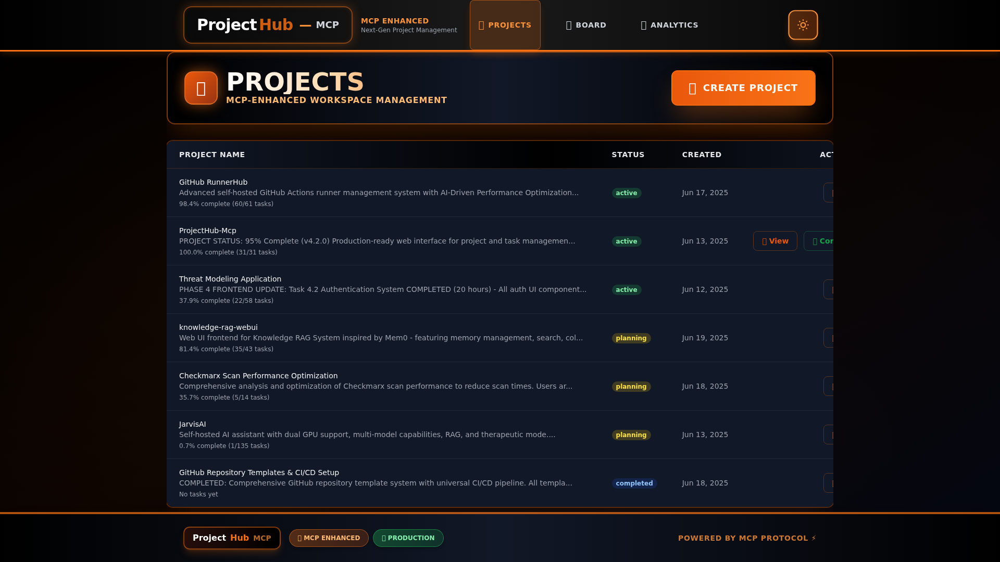
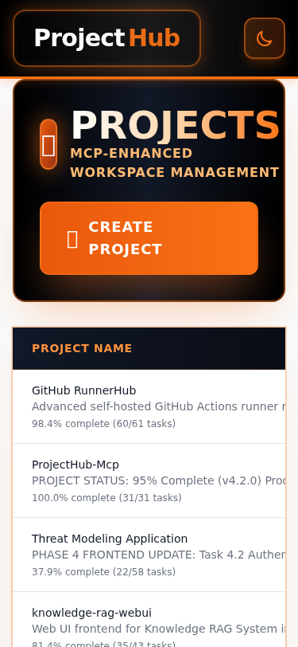
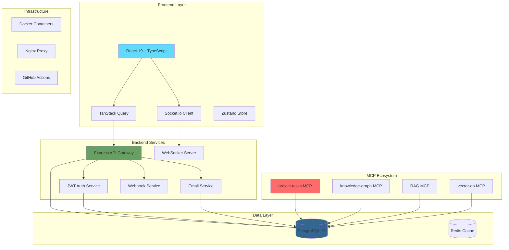

# 🚀 ProjectHub-MCP

[](https://opensource.org/licenses/MIT)
[](https://github.com/anubissbe/ProjectHub-Mcp/releases)
[](https://reactjs.org/)
[](https://www.typescriptlang.org/)
[](https://nodejs.org/)
[](https://www.postgresql.org/)
[](https://www.docker.com/)
[](https://github.com/anubissbe/ProjectHub-Mcp)

> 🎯 **Enterprise-grade project management system** with real-time collaboration, advanced analytics, team management, and seamless MCP (Model Context Protocol) integration

<div align="center">
  
</div>

## 📸 Screenshots

<div align="center">

### 🏠 Homepage & Project Overview



### 📋 Kanban Board & Task Management


### 📊 Analytics & Reporting


### 📱 Mobile & Responsive Design



</div>

## 📊 Project Status

🚀 **Status**: Production Ready & Feature Complete  
📊 **Scale**: Handles hundreds of tasks and multiple projects  
🔧 **Architecture**: Microservices with Docker deployment  
🏢 **Multi-tenant**: Full workspace isolation and team management  
📈 **Analytics**: Advanced reporting with predictive insights  

## 🎯 Overview

ProjectHub-MCP is a comprehensive, enterprise-grade project and task management system built for modern teams. It provides a powerful web interface with real-time collaboration, advanced analytics, team management, and seamless integration with the MCP ecosystem.

### 🌟 Why Choose ProjectHub-MCP?

- **🏢 Enterprise Ready**: Full multi-tenant architecture with workspace isolation
- **👥 Team Focused**: Complete team management with role-based permissions
- **📊 Data-Driven**: Advanced analytics and predictive insights
- **🔄 Real-Time**: Live collaboration with WebSocket integration
- **🛡️ Secure**: JWT authentication, HMAC webhooks, and comprehensive audit trails
- **🌐 Scalable**: Docker-based microservices architecture
- **📱 Modern UI**: Responsive design with dark mode support

## ✨ Core Features

### 🎯 Project & Task Management
- **📋 Project Management**: Full CRUD operations with status tracking (planning, active, paused, completed, cancelled)
- **✅ Advanced Task System**: Priorities, time estimates, dependencies, subtasks, and custom fields
- **📊 Kanban Board**: Drag-and-drop interface with real-time updates via WebSocket
- **📅 Calendar Integration**: Visualize tasks and deadlines across multiple views
- **🔗 Task Dependencies**: Complex project workflows with dependency management

### 👥 Team Collaboration & Workspaces
- **🏢 Multi-Tenant Workspaces**: Complete data isolation with workspace switching
- **👤 Role-Based Access Control**: Hierarchical permissions (Admin → Manager → Developer → Viewer)
- **👥 Team Management**: Create and manage teams with granular permissions
- **📧 Email Invitations**: Token-based team member invitations with validation
- **🛡️ Project-Level Security**: Granular access control for sensitive projects
- **📊 Workspace Analytics**: Usage statistics, limits, and performance metrics

### 📊 Advanced Analytics & Reporting
- **📈 Interactive Dashboards**: Fully customizable dashboard builder with 6+ widget types
- **📉 Burndown Charts**: Real-time sprint progress with ideal vs actual visualization
- **🚀 Velocity Tracking**: Team velocity analysis with trend predictions and confidence levels
- **👥 Team Performance**: Comprehensive KPI dashboards with radar charts and comparisons
- **🎯 Predictive Analytics**: AI-powered risk assessment and completion predictions
- **📤 Professional Reports**: Multi-format export (PDF, Excel, CSV) with charts and branding
- **⏰ Scheduled Reports**: Automated report generation and email delivery
- **🔍 Advanced Filtering**: Date ranges, teams, projects, and custom criteria

### 📧 Communication & Notifications
- **📬 SMTP Email System**: Complete email delivery with professional templates
- **🎨 Responsive Templates**: 5 HTML email templates for all notification types
- **⚙️ User Preferences**: Comprehensive notification settings with timezone support
- **⏰ Smart Scheduling**: Cron-based digest delivery and intelligent due date reminders
- **🛡️ Rate Limiting**: Database-backed spam prevention with configurable limits
- **🔗 Unsubscribe System**: Token-based unsubscribe with user-friendly pages

### 🔗 Enterprise Integration
- **🎣 Webhook System**: Enterprise-grade webhooks with HMAC security and retry logic
- **📊 Delivery Tracking**: Comprehensive webhook delivery monitoring and statistics
- **🔌 MCP Integration**: Seamless integration with Model Context Protocol servers
- **🌐 REST API**: Comprehensive API for third-party integrations
- **📝 Audit Trails**: Complete activity logging for compliance and security

### 🎨 User Experience
- **⏱️ Pomodoro Timer**: Built-in time tracking with work/break intervals
- **🌓 Dark Mode**: Full dark/light theme support with persistence
- **📱 Responsive Design**: Optimized for desktop, tablet, and mobile devices
- **🔄 Real-time Updates**: Live collaboration with instant notifications
- **🔍 Smart Search**: Advanced filtering and search across all projects
- **⚡ Performance**: Optimized for speed with efficient caching and lazy loading

## 🏗️ Architecture

<div align="center">



</div>

## 🚀 Quick Start

### Prerequisites

- **Docker & Docker Compose** (Required)
- **5 minutes of your time** ⏱️

### 🐳 Instant Deployment (Pre-built Containers)

```bash
# 1. Create project directory
mkdir projecthub-mcp && cd projecthub-mcp

# 2. Download production-ready configuration
curl -L https://raw.githubusercontent.com/anubissbe/ProjectHub-Mcp/main/docker-compose.prod.yml -o docker-compose.yml

# 3. Create environment file (simplified for quick start)
curl -L https://raw.githubusercontent.com/anubissbe/ProjectHub-Mcp/main/.env.quickstart -o .env

# 4. Configure your environment (minimal required changes)
nano .env  # Change JWT_SECRET and DB_PASSWORD at minimum

# 5. Start all services (automatically pulls pre-built images)
docker-compose up -d
# This will pull:
# - Frontend: ghcr.io/anubissbe/projecthub-mcp-frontend:latest
# - Backend: ghcr.io/anubissbe/projecthub-mcp-backend:latest  
# - Database: postgres:17-alpine
# - Cache: redis:8-alpine

# 6. Access your application
echo "🎉 ProjectHub-MCP is ready!"
echo "Frontend: http://localhost:5173"
echo "Backend API: http://localhost:3001/api"
echo "Health Check: http://localhost:3001/api/health"

# 7. Create your first admin user
echo "👤 Visit http://localhost:5173 and register your admin account"
```

**That's it!** No building, no compilation - just download and run!

#### 🚀 Why This Is Better:
- **⚡ Instant Setup**: No need to install Node.js, build tools, or wait for compilation
- **🔄 Auto-Updated**: Images are automatically built from the latest code via GitHub Actions
- **🛡️ Production-Ready**: Pre-built images are optimized and security-scanned
- **📦 Consistent**: Same images used in development, staging, and production
- **💾 Smaller Download**: Only download what you need, when you need it

#### 📋 Container Details:
The Docker Compose configuration automatically pulls these production-ready images:
- **Frontend**: React app built with Vite, served by Nginx
- **Backend**: Node.js API server with all dependencies
- **Database**: PostgreSQL 17 with optimized configuration
- **Cache**: Redis for session storage and caching (optional)

### 🛠️ Local Development

```bash
# Install dependencies
npm install
cd frontend && npm install
cd ../backend && npm install

# Set up environment variables
cp .env.example .env
# Edit .env file with your configuration

# Start database (if using Docker)
docker-compose up -d postgres

# Run database migrations
cd backend && npm run migrate

# Start development servers
# Terminal 1 - Backend
cd backend && npm run dev

# Terminal 2 - Frontend  
cd frontend && npm run dev
```

## ⚙️ Configuration

### Environment Variables

Create a `.env` file in the root directory:

```bash
# Database Configuration
DATABASE_URL=postgresql://[username]:[password]@[host]:[port]/[database]
POSTGRES_HOST=your-postgres-host
POSTGRES_PORT=5432
POSTGRES_USER=your-username
POSTGRES_PASSWORD=your-password
POSTGRES_DB=projecthub_mcp

# Application Configuration
NODE_ENV=production
PORT=3001
FRONTEND_URL=http://localhost:5173

# JWT Authentication (Use strong, unique secrets)
JWT_ACCESS_SECRET=your-very-secure-access-token-secret-min-32-chars
JWT_REFRESH_SECRET=your-very-secure-refresh-token-secret-min-32-chars

# Email Configuration
SMTP_HOST=smtp.gmail.com
SMTP_PORT=587
SMTP_USER=your-email@gmail.com
SMTP_PASSWORD=your-app-password
FROM_EMAIL=noreply@yourcompany.com
FROM_NAME="ProjectHub Team"

# WebSocket Configuration
WEBSOCKET_ENABLED=true
CORS_ORIGIN=http://localhost:5173

# MCP Server URLs (Optional - for enhanced integrations)
KNOWLEDGE_GRAPH_URL=http://localhost:8001
RAG_URL=http://localhost:8002
VECTOR_DB_URL=http://localhost:8003
UNIFIED_DB_URL=http://localhost:8004

# Webhook Security
WEBHOOK_SECRET=your-webhook-secret-for-hmac-verification

# Rate Limiting
RATE_LIMIT_WINDOW_MS=900000
RATE_LIMIT_MAX_REQUESTS=100
```

### Database Setup

```bash
# Using Docker (Recommended)
docker-compose up -d postgres

# Or install PostgreSQL 16+ locally
# Then create database and run migrations:
cd backend
npm run migrate
```

## 📁 Project Structure

```
ProjectHub-Mcp/
├── 📁 backend/                 # Express.js backend service
│   ├── 📁 src/
│   │   ├── 📁 controllers/     # API route handlers
│   │   ├── 📁 services/        # Business logic layer
│   │   ├── 📁 middleware/      # Express middleware
│   │   ├── 📁 routes/          # API route definitions
│   │   ├── 📁 types/           # TypeScript type definitions
│   │   ├── 📁 utils/           # Utility functions
│   │   └── 📄 index.ts         # Application entry point
│   ├── 📁 migrations/          # Database migration scripts
│   ├── 📁 templates/           # Email templates
│   └── 📄 package.json
├── 📁 frontend/                # React frontend application
│   ├── 📁 src/
│   │   ├── 📁 components/      # Reusable React components
│   │   ├── 📁 pages/           # Page-level components
│   │   ├── 📁 hooks/           # Custom React hooks
│   │   ├── 📁 services/        # API service layer
│   │   ├── 📁 stores/          # Zustand state management
│   │   ├── 📁 contexts/        # React contexts
│   │   ├── 📁 types/           # TypeScript definitions
│   │   └── 📄 App.tsx          # Main application component
│   └── 📄 package.json
├── 📁 docs/                    # Comprehensive documentation
│   ├── 📁 api/                 # API documentation
│   ├── 📁 architecture/        # System architecture docs
│   ├── 📁 deployment/          # Deployment guides
│   └── 📁 images/              # Screenshots and diagrams
├── 📁 tests/                   # Test suites and E2E tests
│   ├── 📁 e2e/                 # End-to-end tests
│   └── 📄 ui-test.js           # UI testing utilities
├── 📁 scripts/                 # Deployment and utility scripts
├── 📁 wiki/                    # GitHub wiki content
├── 📄 docker-compose.yml       # Docker orchestration
├── 📄 docker-compose.prod.yml  # Production configuration
└── 📄 README.md               # This file
```

## 🔧 Technology Stack

### Frontend Stack
| Technology | Version | Purpose |
|------------|---------|---------|
| **React** | 19.1.0 | UI framework with latest features |
| **TypeScript** | 5.0+ | Type safety and developer experience |
| **Vite** | Latest | Lightning-fast build tool and dev server |
| **Tailwind CSS** | 3.x | Utility-first styling with design system |
| **TanStack Query** | v5 | Powerful data fetching and caching |
| **React Router** | v7 | Client-side routing with data loading |
| **Zustand** | Latest | Lightweight state management |
| **Recharts** | Latest | Beautiful, responsive data visualization |
| **Socket.io-client** | Latest | Real-time bidirectional communication |

### Backend Stack
| Technology | Version | Purpose |
|------------|---------|---------|
| **Node.js** | 18+ | JavaScript runtime environment |
| **Express.js** | 4.18+ | Fast, unopinionated web framework |
| **TypeScript** | 5.0+ | Type safety for backend services |
| **PostgreSQL** | 16+ | Robust relational database |
| **Socket.io** | Latest | Real-time WebSocket server |
| **Zod** | Latest | Runtime type validation |
| **Winston** | Latest | Professional logging solution |
| **Jest** | Latest | Comprehensive testing framework |
| **Nodemailer** | Latest | Email delivery service |

### Infrastructure & DevOps
| Technology | Purpose |
|------------|---------|
| **Docker** | Containerization for consistent deployments |
| **Docker Compose** | Multi-container orchestration |
| **Nginx** | Web server and reverse proxy |
| **GitHub Actions** | CI/CD pipeline automation |
| **Playwright** | End-to-end testing |
| **ESLint + Prettier** | Code quality and formatting |

## 🌐 API Documentation

### Core API Endpoints

#### Authentication & User Management
```bash
POST   /api/auth/register          # Register new user
POST   /api/auth/login             # User authentication
POST   /api/auth/logout            # Logout current session
POST   /api/auth/refresh-token     # Refresh access token
GET    /api/auth/me                # Get current user profile
POST   /api/auth/change-password   # Change user password
```

#### Workspace Management
```bash
GET    /api/workspaces             # List user workspaces
POST   /api/workspaces             # Create new workspace
GET    /api/workspaces/:id         # Get workspace details
PUT    /api/workspaces/:id         # Update workspace
DELETE /api/workspaces/:id         # Delete workspace
POST   /api/workspaces/:id/invite  # Invite workspace member
```

#### Project & Task Management
```bash
GET    /api/projects               # List all projects
POST   /api/projects               # Create new project
GET    /api/projects/:id           # Get project details
PUT    /api/projects/:id           # Update project
DELETE /api/projects/:id           # Delete project
GET    /api/projects/:id/tasks     # Get project tasks
POST   /api/tasks                  # Create new task
PUT    /api/tasks/:id              # Update task
DELETE /api/tasks/:id              # Delete task
```

#### Advanced Analytics & Reporting
```bash
GET    /api/reports/dashboards     # List custom dashboards
POST   /api/reports/dashboards     # Create dashboard
GET    /api/reports/advanced-metrics  # Comprehensive analytics
GET    /api/reports/burndown       # Burndown chart data
GET    /api/reports/velocity-trends   # Velocity analysis
POST   /api/reports/export/:id     # Export reports (PDF/Excel/CSV)
```

#### Team & Collaboration
```bash
GET    /api/teams                  # List user teams
POST   /api/teams                  # Create new team
POST   /api/teams/:id/invite       # Invite team member
PUT    /api/teams/:id/members/:userId  # Update member role
```

For complete API documentation, see [docs/API.md](docs/API.md).

## 📊 Database Schema

### Core Tables Overview

- **🏢 Workspaces**: Multi-tenant workspace management with settings and limits
- **👥 Users & Authentication**: User accounts, sessions, and preferences
- **🛡️ Teams & Permissions**: Team management with role-based access control
- **📋 Projects & Tasks**: Core project management with task hierarchies
- **📊 Analytics & Reporting**: Dashboard configurations and metrics
- **📧 Notifications**: Email preferences and delivery tracking
- **🔗 Webhooks**: Integration endpoints with delivery history
- **📝 Audit Logs**: Comprehensive activity tracking for compliance

For detailed schema documentation, see [docs/architecture/README.md](docs/architecture/README.md).

## 🧪 Testing & Quality Assurance

### Test Suites

```bash
# Backend Tests
cd backend
npm test                    # Unit and integration tests
npm run test:coverage       # Generate coverage report

# Frontend Tests
cd frontend  
npm test                    # Component and hook tests
npm run test:coverage       # Frontend coverage

# End-to-End Tests
npm run test:e2e            # Full application testing
npm run test:e2e:headed     # Run with browser UI

# Code Quality
npm run lint                # ESLint checks
npm run typecheck           # TypeScript validation
npm run format              # Prettier formatting
```

### Quality Metrics
- **📊 Backend Coverage**: 85%+ test coverage
- **🎯 Frontend Coverage**: 80%+ component coverage  
- **🔍 E2E Testing**: Critical user workflows covered
- **🛡️ Security**: Automated vulnerability scanning
- **⚡ Performance**: Lighthouse scores 90+ across metrics

## 🚀 Deployment

### Production Deployment Options

#### Option 1: Docker Compose (Recommended)
```bash
# Clone and configure
git clone https://github.com/anubissbe/ProjectHub-Mcp.git
cd ProjectHub-Mcp
cp .env.example .env
# Edit .env with production values

# Deploy with production configuration
docker-compose -f docker-compose.prod.yml up -d

# Verify deployment
curl http://localhost:3001/api/health
```

#### Option 2: Synology NAS Deployment
```bash
# Use included Synology-specific configuration
docker-compose -f docker-compose.synology.yml up -d

# Or use quick upgrade script
./scripts/deployment/quick-upgrade.sh
```

#### Option 3: Cloud Deployment
The application is ready for deployment on:
- **AWS ECS/Fargate** with RDS PostgreSQL
- **Google Cloud Run** with Cloud SQL
- **Azure Container Instances** with Azure Database
- **DigitalOcean App Platform**

### CI/CD Pipeline

Our GitHub Actions workflow automatically:
- ✅ **Tests**: Runs all test suites on every commit
- ✅ **Security**: Performs security scanning and vulnerability assessment
- ✅ **Quality**: Enforces code quality standards with ESLint and TypeScript
- ✅ **Build**: Creates optimized Docker images for production
- ✅ **Deploy**: Automated deployment to staging and production environments

## 📈 Performance & Scalability

### Performance Optimizations
- **⚡ Frontend**: Code splitting, lazy loading, and optimized bundle sizes
- **🔄 Backend**: Connection pooling, query optimization, and caching layers
- **📊 Database**: Optimized indexes, query planning, and connection management
- **🌐 Network**: Gzip compression, CDN-ready assets, and efficient API design

### Scalability Features
- **🏢 Multi-tenant**: Workspace isolation for unlimited organizational growth
- **🔄 Horizontal Scaling**: Stateless backend services for easy scaling
- **📊 Efficient Queries**: Optimized database queries with pagination and filtering
- **🗄️ Data Management**: Automated cleanup and archiving for long-term performance

## 🤝 Contributing

We welcome contributions from the community! Please read our [Contributing Guidelines](CONTRIBUTING.md) for details.

### Development Workflow
1. **Fork** the repository
2. **Create** a feature branch: `git checkout -b feature/amazing-feature`
3. **Commit** your changes: `git commit -m 'feat: add amazing feature'`
4. **Test** your changes: `npm test`
5. **Push** to the branch: `git push origin feature/amazing-feature`
6. **Create** a Pull Request

### Code Standards
- **TypeScript**: Strict type checking enabled
- **ESLint**: Enforced code quality standards
- **Prettier**: Consistent code formatting
- **Conventional Commits**: Standardized commit message format
- **Test Coverage**: Maintain or improve test coverage

## 📋 Roadmap & Version History

### ✅ Version 4.5.1 (Current - Production Ready)
- ✅ **Complete Feature Set**: All core functionality implemented and tested
- ✅ **Production Deployment**: Successfully deployed and running in production
- ✅ **Security Hardening**: All security vulnerabilities resolved
- ✅ **Performance Optimization**: Optimized for production workloads
- ✅ **Documentation**: Comprehensive documentation and API references

### 🎯 Previous Major Releases

#### Version 4.4.0 - Email Notifications System
- ✅ SMTP email service with professional templates
- ✅ User notification preferences with timezone support
- ✅ Automated digest delivery and reminder scheduling
- ✅ Rate limiting and unsubscribe system

#### Version 4.3.0 - Advanced Analytics & Reporting
- ✅ Interactive dashboard builder with drag-and-drop widgets
- ✅ Burndown charts and velocity tracking with predictions
- ✅ Team performance metrics and KPI dashboards
- ✅ Multi-format export capabilities (PDF, Excel, CSV)

#### Version 4.2.0 - Team Management & Workspaces
- ✅ Multi-tenant workspace architecture
- ✅ Role-based access control and permissions
- ✅ Team invitation system with email validation
- ✅ Granular project-level security

### 🚧 Future Enhancements (Post v4.5.1)
- 📱 **Mobile Applications**: Native iOS and Android apps
- 🤖 **AI Integration**: Intelligent task suggestions and automation
- 🌍 **Internationalization**: Multi-language support
- 🔗 **Third-party Integrations**: Slack, Microsoft Teams, Jira connectors
- 🎨 **Advanced Theming**: Custom branding and theme builder

## 📄 License

This project is licensed under the MIT License - see the [LICENSE](LICENSE) file for details.

### Third-Party Licenses
All dependencies are licensed under permissive licenses compatible with commercial use. See the respective package.json files for detailed dependency information.

## 🙏 Acknowledgments

- **MCP Ecosystem**: Built for seamless integration with Model Context Protocol
- **Open Source Community**: Leveraging the best open-source technologies
- **Contributors**: Special thanks to all developers who have contributed
- **Testers**: Community members who helped test and improve the application

## 📞 Support & Community

### Getting Help
- 📚 **Documentation**: [GitHub Wiki](https://github.com/anubissbe/ProjectHub-Mcp/wiki)
- 🐛 **Bug Reports**: [GitHub Issues](https://github.com/anubissbe/ProjectHub-Mcp/issues)
- 💬 **Discussions**: [GitHub Discussions](https://github.com/anubissbe/ProjectHub-Mcp/discussions)
- 📧 **Email Support**: For enterprise inquiries and support

### Support Development
- ⭐ **Star** this repository if you find it useful
- ☕ **Buy Me A Coffee**: [Support Development](https://buymeacoffee.com/anubissbe)
- 🤝 **Contribute**: Submit pull requests and improvements
- 📢 **Share**: Help others discover ProjectHub-MCP

---

<div align="center">
  <h3>🚀 Built for Modern Teams</h3>
  <p><strong>Enterprise-grade project management made simple</strong></p>
  <p><em>Powered by React, TypeScript, and PostgreSQL</em></p>
  
  <br>
  
  **[🌟 Star on GitHub](https://github.com/anubissbe/ProjectHub-Mcp)** • 
  **[📚 View Documentation](https://github.com/anubissbe/ProjectHub-Mcp/wiki)** • 
  **[🚀 Try Demo](https://your-demo-url.com)**
  
  <br><br>
  
  
  
  
</div>