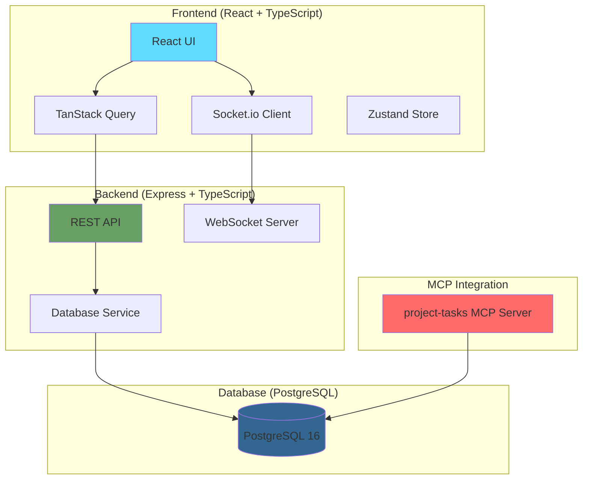

# 🚀 ProjectHub-MCP

[](https://opensource.org/licenses/MIT)
[](https://reactjs.org/)
[](https://www.typescriptlang.org/)
[](https://nodejs.org/)
[](https://www.postgresql.org/)
[](https://www.docker.com/)
[](https://github.com/anubissbe/ProjectHub-Mcp)
[](https://buymeacoffee.com/anubissbe)

> 🎯 A modern, feature-rich project management system with real-time collaboration, advanced analytics, and seamless MCP (Model Context Protocol) integration

## 📊 Project Status

🚀 **Status**: Production Ready  
📊 **Scale**: Handles hundreds of tasks and multiple projects  
🔧 **Architecture**: Microservices with Docker deployment

## 🎯 Overview

ProjectHub-MCP is a comprehensive project and task management system built specifically for the MCP-Enhanced Workspace. It provides a modern web interface for managing projects and tasks stored in PostgreSQL, with real-time updates, advanced analytics, and seamless integration with the project-tasks MCP server.

### ✨ Key Features

#### 🎯 Core Project Management
- **📋 Project Management**: Full CRUD operations with status tracking (planning, active, paused, completed, cancelled)
- **✅ Task Management**: Create, update, and track tasks with priorities, time estimates, and dependencies
- **📊 Kanban Board**: Drag-and-drop interface with real-time updates via WebSocket
- **🔗 Webhook Integration**: Enterprise-grade webhook system with retry logic, HMAC security, and delivery tracking

#### 👥 Team Collaboration & Workspaces
- **🏢 Team Management**: Create and manage teams with role-based permissions
- **🔐 Advanced Authentication**: JWT-based auth with refresh tokens and session management
- **👤 User Roles**: Hierarchical permissions (Admin → Manager → Developer → Viewer)
- **📧 Team Invitations**: Email-based team member invitations with token validation
- **🛡️ Granular Permissions**: Project-level access control for teams and individuals
- **🏠 Workspace Isolation**: Multi-tenant data separation with complete project isolation
- **🔄 Workspace Switching**: Seamless context switching between workspaces
- **📊 Workspace Analytics**: Per-workspace usage statistics and limits

#### 📊 Advanced Analytics & Reporting
- **📈 Analytics Dashboard**: Comprehensive charts for project progress, task distribution, and team productivity
- **📊 Advanced Reporting**: Custom dashboard builder with drag-and-drop widgets
- **📉 Velocity Tracking**: Sprint velocity, burndown charts, and performance metrics
- **🔍 Predictive Analytics**: AI-powered insights and bottleneck detection
- **📤 Export Reports**: PDF, Excel, CSV exports with scheduled delivery
- **📋 KPI Dashboards**: Real-time team performance and project health metrics

#### 🎨 User Experience
- **⏱️ Pomodoro Timer**: Built-in time tracking with work/break intervals
- **📅 Calendar View**: Visualize tasks and deadlines in a calendar format
- **📱 Responsive Design**: Optimized for desktop, tablet, and mobile devices
- **🌓 Dark Mode**: Full dark/light theme support with persistence
- **🔄 Real-time Updates**: WebSocket integration for live collaboration
- **🔍 Advanced Search**: Filter and search tasks across all projects

## 🏗️ Architecture



## 🚀 Quick Start

### Prerequisites

- Docker and Docker Compose
- Node.js 18+ (for local development)
- PostgreSQL 16 (or access to remote instance)
- Git

### 🐳 Docker Deployment (Recommended)

```bash
# 1. Clone the repository
git clone https://github.com/anubissbe/ProjectHub-Mcp.git
cd ProjectHub-Mcp

# 2. Configure environment
cp .env.example .env
# Edit .env with your database credentials

# 3. Start all services
docker-compose up -d

# 4. Access the application
# Frontend: http://localhost:5173
# Backend API: http://localhost:3001/api
```

### 🛠️ Local Development

```bash
# Install dependencies
npm install
cd frontend && npm install
cd ../backend && npm install

# Set up environment variables
cp .env.example .env
# Edit .env file

# Start development servers
# Terminal 1 - Backend
cd backend && npm run dev

# Terminal 2 - Frontend
cd frontend && npm run dev
```

## ⚙️ Configuration

### Required Environment Variables

Create a `.env` file in the root directory:

```bash
# Database Configuration
DATABASE_URL=postgresql://[username]:[password]@[host]:[port]/[database]
POSTGRES_HOST=your-postgres-host
POSTGRES_PORT=5432
POSTGRES_USER=your-username
POSTGRES_PASSWORD=your-password
POSTGRES_DB=your-database

# Application Configuration
NODE_ENV=production
PORT=3001
FRONTEND_URL=http://localhost:5173

# JWT Authentication
JWT_ACCESS_SECRET=your-very-secure-access-token-secret
JWT_REFRESH_SECRET=your-very-secure-refresh-token-secret

# WebSocket Configuration
WEBSOCKET_ENABLED=true

# Email Configuration (for invitations)
SMTP_HOST=smtp.gmail.com
SMTP_PORT=587
SMTP_USER=your-email@gmail.com
SMTP_PASSWORD=your-app-password
```

## 📁 Project Structure

```
ProjectHub-Mcp/
├── backend/                # Express.js backend
│   ├── src/
│   │   ├── routes/        # API routes
│   │   ├── services/      # Business logic
│   │   ├── models/        # Data models
│   │   ├── middleware/    # Express middleware
│   │   └── app.ts         # Application entry
│   └── package.json
├── frontend/              # React frontend
│   ├── src/
│   │   ├── components/    # React components
│   │   ├── pages/         # Page components
│   │   ├── hooks/         # Custom hooks
│   │   ├── stores/        # Zustand stores
│   │   └── App.tsx        # Main application
│   └── package.json
├── docs/                  # Documentation
├── tests/                 # Test suites
├── docker-compose.yml     # Docker orchestration
└── README.md             # This file
```

## 🔧 Technology Stack

### Frontend
- **React 19.1.0** - UI framework
- **TypeScript 5.0** - Type safety
- **Vite** - Build tool and dev server
- **Tailwind CSS** - Utility-first styling
- **TanStack Query v5** - Data fetching and caching
- **React Router v7** - Client-side routing
- **Zustand** - State management
- **Recharts** - Data visualization
- **Socket.io-client** - Real-time updates

### Backend
- **Node.js 18+** - Runtime environment
- **Express.js 4.18** - Web framework
- **TypeScript** - Type safety
- **PostgreSQL 16** - Primary database
- **Socket.io** - WebSocket server
- **Zod** - Schema validation
- **Winston** - Logging
- **Jest** - Testing framework

### Infrastructure
- **Docker** - Containerization
- **Docker Compose** - Service orchestration
- **Nginx** - Web server for frontend
- **GitHub Actions** - CI/CD pipeline

## 🌐 API Documentation

### Workspace Management Endpoints

| Method | Endpoint | Description |
|--------|----------|-------------|
| GET | `/api/workspaces` | List user's workspaces |
| GET | `/api/workspaces/:id` | Get workspace details |
| POST | `/api/workspaces` | Create new workspace |
| PUT | `/api/workspaces/:id` | Update workspace |
| DELETE | `/api/workspaces/:id` | Delete workspace (soft) |
| GET | `/api/workspaces/:id/members` | Get workspace members |
| POST | `/api/workspaces/:id/invite` | Invite member to workspace |
| PUT | `/api/workspaces/:id/members/:userId/role` | Update member role |
| DELETE | `/api/workspaces/:id/members/:userId` | Remove member |
| POST | `/api/workspaces/:id/switch` | Switch active workspace |
| GET | `/api/workspaces/:id/stats` | Get workspace statistics |
| POST | `/api/workspaces/invitations/:token/accept` | Accept invitation |

### Authentication Endpoints

| Method | Endpoint | Description |
|--------|----------|-------------|
| POST | `/api/auth/login` | User login with email/password |
| POST | `/api/auth/register` | Register new user account |
| POST | `/api/auth/logout` | Logout current session |
| POST | `/api/auth/logout-all` | Logout from all devices |
| POST | `/api/auth/refresh-token` | Refresh access token |
| GET | `/api/auth/me` | Get current user profile |
| POST | `/api/auth/change-password` | Change user password |
| GET | `/api/auth/health` | Authentication service health |

### Team Management Endpoints

| Method | Endpoint | Description |
|--------|----------|-------------|
| GET | `/api/teams` | List user's teams |
| GET | `/api/teams/:id` | Get team details |
| POST | `/api/teams` | Create new team |
| PUT | `/api/teams/:id` | Update team |
| DELETE | `/api/teams/:id` | Delete team |
| GET | `/api/teams/:id/members` | Get team members |
| POST | `/api/teams/:id/invite` | Invite team member |
| PUT | `/api/teams/:id/members/:userId` | Update member role |
| DELETE | `/api/teams/:id/members/:userId` | Remove team member |
| GET | `/api/teams/:id/stats` | Get team statistics |

### Projects Endpoints

| Method | Endpoint | Description |
|--------|----------|-------------|
| GET | `/api/projects` | List all projects |
| GET | `/api/projects/:id` | Get project details |
| POST | `/api/projects` | Create new project |
| PUT | `/api/projects/:id` | Update project |
| DELETE | `/api/projects/:id` | Delete project |
| GET | `/api/projects/:id/stats` | Get project statistics |

### Tasks Endpoints

| Method | Endpoint | Description |
|--------|----------|-------------|
| GET | `/api/projects/:projectId/tasks` | Get tasks by project |
| GET | `/api/tasks/:id` | Get task details |
| POST | `/api/tasks` | Create task |
| PUT | `/api/tasks/:id` | Update task |
| PATCH | `/api/tasks/:id/status` | Update task status |
| DELETE | `/api/tasks/:id` | Delete task |
| GET | `/api/tasks/:id/history` | Get task history |
| GET | `/api/next-task` | Get next prioritized task |

### Reporting & Analytics Endpoints

| Method | Endpoint | Description |
|--------|----------|-------------|
| GET | `/api/reports/dashboards` | List user dashboards |
| GET | `/api/reports/dashboards/:id` | Get dashboard details |
| POST | `/api/reports/dashboards` | Create custom dashboard |
| PUT | `/api/reports/dashboards/:id` | Update dashboard |
| DELETE | `/api/reports/dashboards/:id` | Delete dashboard |
| POST | `/api/reports/widget-data` | Get widget data |
| POST | `/api/reports/export/:id` | Export dashboard report |
| GET | `/api/reports/advanced-metrics` | Get advanced analytics |
| GET | `/api/reports/team-performance` | Team performance metrics |

### Webhooks Endpoints

| Method | Endpoint | Description |
|--------|----------|-------------|
| GET | `/api/webhooks` | List all webhooks |
| GET | `/api/webhooks/:id` | Get webhook details |
| POST | `/api/webhooks` | Create new webhook |
| PUT | `/api/webhooks/:id` | Update webhook |
| DELETE | `/api/webhooks/:id` | Delete webhook |
| POST | `/api/webhooks/:id/test` | Test webhook endpoint |
| GET | `/api/webhooks/:id/deliveries` | Get delivery history |
| GET | `/api/webhooks/:id/stats` | Get webhook statistics |
| GET | `/api/webhooks/templates` | Get webhook templates |

## 📊 Database Schema

The application uses PostgreSQL with the following main tables:

### Workspace Management
- **workspaces** - Multi-tenant workspace definitions with settings and limits
- **workspace_members** - Workspace membership with roles (owner, admin, member)
- **workspace_invitations** - Pending workspace invitations with tokens

### Core Tables
- **projects** - Project management with workspace isolation
- **tasks** - Task details with priorities and time tracking
- **task_dependencies** - Task relationships
- **task_history** - Audit trail for changes
- **test_results** - Test execution tracking
- **task_insights** - Learning insights from completed tasks

### Authentication & User Management
- **users** - User accounts with roles and preferences
- **user_sessions** - JWT refresh token management with workspace context
- **user_preferences** - Personal settings and per-workspace preferences
- **activity_logs** - Comprehensive audit trail with workspace tracking

### Team Management
- **teams** - Team definitions with workspace association
- **team_members** - Many-to-many team membership with roles
- **team_invitations** - Email-based invitation system
- **project_permissions** - Granular project access control

### Webhooks & Integration
- **webhooks** - Webhook configuration with optional workspace scope
- **webhook_deliveries** - Delivery tracking with retry logic

## 🧪 Testing

```bash
# Run backend tests
cd backend && npm test

# Run frontend tests
cd frontend && npm test

# Run E2E tests
npm run test:e2e

# Generate coverage report
npm run test:coverage
```

## 🚀 Deployment

### Production Deployment

The application is deployed on Synology NAS using Docker:

```bash
# Build and deploy
./quick-upgrade.sh

# Or manually
docker-compose -f docker-compose.prod.yml up -d
```

### CI/CD Pipeline

The project uses GitHub Actions for automated:
- ✅ Testing on every commit
- ✅ Security scanning
- ✅ Code quality checks
- ✅ Docker image building
- ✅ Automated deployment

## 🤝 Contributing

We welcome contributions! Please see our [Contributing Guidelines](CONTRIBUTING.md) for details.

1. Fork the repository
2. Create a feature branch: `git checkout -b feature/amazing-feature`
3. Commit your changes: `git commit -m 'Add amazing feature'`
4. Push to the branch: `git push origin feature/amazing-feature`
5. Open a Pull Request

## 📋 Roadmap

### ✅ Completed Features (v4.1.0)
- ✅ Project and task CRUD operations
- ✅ Kanban board with drag-and-drop
- ✅ Real-time updates via WebSocket
- ✅ Dark mode support
- ✅ Analytics dashboard
- ✅ Pomodoro timer
- ✅ Calendar view
- ✅ Export functionality
- ✅ **Enterprise webhook system** with HMAC security, retry logic, and delivery tracking
- ✅ **Complete authentication system** with JWT, refresh tokens, and session management
- ✅ **Team management** with role-based permissions and invitations
- ✅ **Advanced reporting** with custom dashboards and analytics
- ✅ **Granular permissions** for project-level access control

### 🚧 In Progress (v4.2.0)
- 🔄 Workspace isolation for multi-tenant support
- 🔄 Scheduled report generation and automated delivery
- 🔄 Enhanced mobile responsiveness
- 🔄 Advanced E2E testing suite

### 📅 Future Plans (v5.0+)
- 📱 Native mobile applications (iOS/Android)
- 🤖 AI-powered task suggestions and automation
- 🌍 Multi-language support (i18n)
- 🔗 Third-party integrations (Slack, Microsoft Teams, Jira)
- 📊 Advanced performance analytics and optimization
- 🎨 Customizable themes and branding

## 📄 License

This project is licensed under the MIT License - see the [LICENSE](LICENSE) file for details.

## 🙏 Acknowledgments

- Built as part of the MCP-Enhanced Workspace ecosystem
- Inspired by modern project management best practices
- Special thanks to all contributors

## 📞 Support

- ☕ **Buy Me A Coffee**: [Support Development](https://buymeacoffee.com/anubissbe)
- 🐛 **Issues**: [GitHub Issues](https://github.com/anubissbe/ProjectHub-Mcp/issues)
- 💬 **Discussions**: [GitHub Discussions](https://github.com/anubissbe/ProjectHub-Mcp/discussions)
- 📚 **Documentation**: [Project Wiki](https://github.com/anubissbe/ProjectHub-Mcp/wiki)

---

<div align="center">
  <strong>Built with ❤️ for efficient project management</strong>
  <br>
  <em>Powered by React, TypeScript, and PostgreSQL</em>
</div>