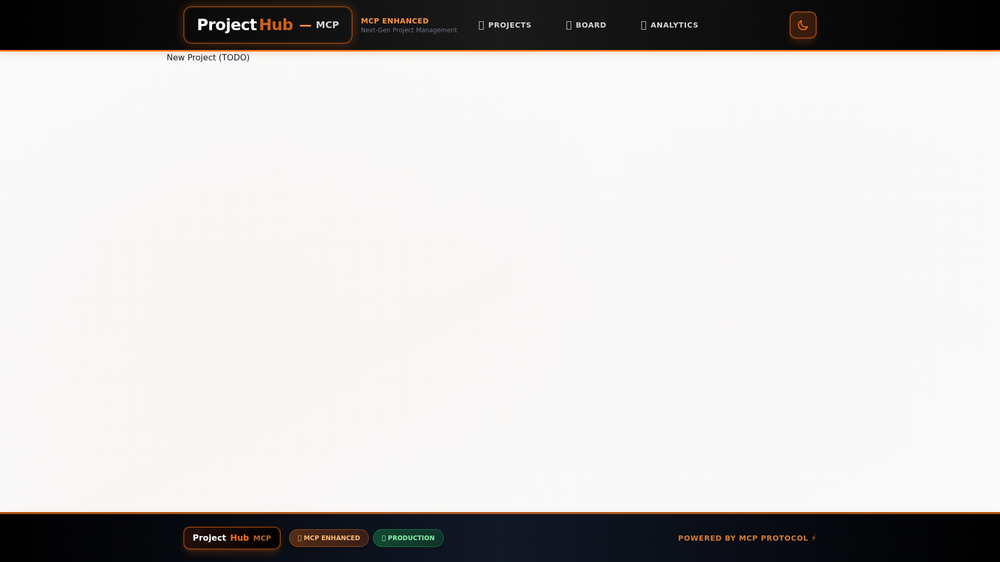
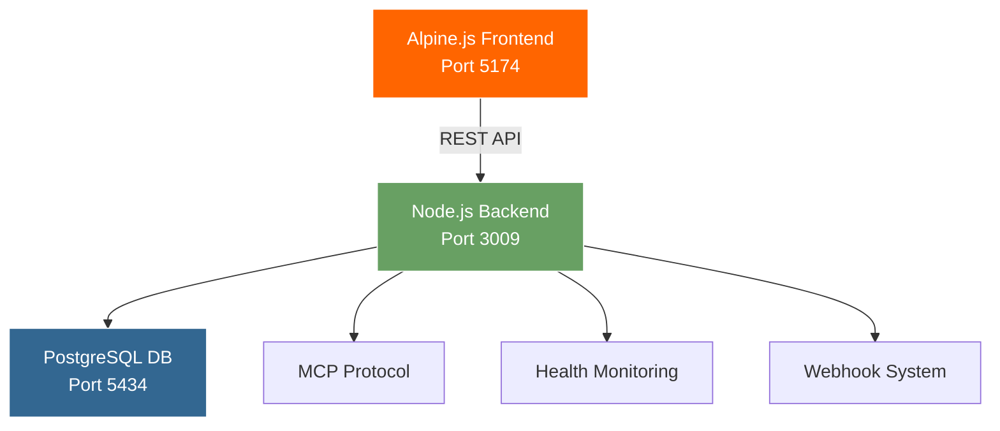

# ProjectHub-MCP v5.0.0

<div align="center">
  
  
  
  
  
</div>

<br/>

<div align="center">
  <h2>🚀 Enterprise Project Management Platform</h2>
  <p><strong>Modern, AI-integrated project management with real-time collaboration and powerful analytics</strong></p>
</div>

<div align="center">
  <a href="QUICKSTART.md">🚀 Quick Start</a> •
  <a href="INSTALLATION.md">📦 Installation</a> •
  <a href="#-screenshots">Screenshots</a> •
  <a href="#-ai-integration">AI Setup</a> •
  <a href="#-features">Features</a> •
  <a href="https://github.com/anubissbe/ProjectHub-Mcp/wiki">📚 Wiki</a>
</div>

---

## 🎯 Overview

ProjectHub-MCP is a cutting-edge project management platform designed for modern development teams. Built with enterprise-grade architecture and featuring a sleek dark theme with signature orange accents, it delivers powerful tools for managing projects, tracking tasks, and analyzing team performance in real-time.

### 🏆 Why Choose ProjectHub-MCP?

- **🚀 Modern Stack**: Alpine.js frontend, Node.js/Express backend, PostgreSQL database
- **🎨 Professional UI**: Dark theme with custom orange branding (#ff6500)
- **📊 Real Analytics**: Live dashboards with actual data calculations
- **🤖 AI Ready**: Full Claude Code and MCP protocol integration
- **🔒 Enterprise Security**: JWT auth, bcrypt encryption, rate limiting
- **🐳 Container First**: Complete Docker orchestration with health checks
- **⚡ Real-time**: Instant updates with live data synchronization

## ✨ Features

### 📋 Project Management
- **Complete CRUD Operations**: Create, read, update, and delete projects with cascade deletion
- **Status Tracking**: Planning → Active → Paused → Completed → Cancelled
- **Progress Visualization**: Real-time progress bars and completion tracking
- **Project Analytics**: Individual project metrics and performance insights

### ✅ Task Management
- **Interactive Kanban Board**: Drag-and-drop interface with project switching
- **Priority Levels**: High, Medium, Low with visual color coding
- **Status Management**: Todo → In Progress → Done with seamless transitions
- **Time Tracking**: Estimated vs actual time comparison and logging
- **Task Dependencies**: Link related tasks and track blockers

### 📊 Analytics Dashboard
- **Real-Time Metrics**: Live calculation of project and task statistics
- **Visual Charts**: Project status distribution, task priority breakdown
- **Performance Tracking**: Team productivity and velocity measurements
- **Data Export**: Export analytics in multiple formats

### 👥 Team Collaboration
- **Role-Based Access**: Admin controls with secure authentication
- **Activity Tracking**: Monitor all project and task modifications
- **User Management**: Secure login/logout with session management

### 🔔 Integrations
- **Webhook Support**: Connect to Slack, Discord, Teams with CORS handling
- **API Access**: Full RESTful API with comprehensive endpoints
- **MCP Protocol**: Native support for AI coding assistants like Claude Code
- **Health Monitoring**: Complete system health checks and status reporting

## 🖼️ Screenshots

### Dashboard Overview

*Modern dashboard with dark theme and orange accents. Features project cards with real-time status indicators and progress tracking.*

### Kanban Board

*Interactive kanban board with drag-and-drop functionality. Project switching now works correctly with proper task filtering.*

### Analytics Dashboard

*Comprehensive analytics with real-time data visualization. All metrics are calculated live from actual database data.*

### Project Management

*Project management interface with full CRUD operations, including safe cascade deletion functionality.*

## 🚀 Quick Start

**Ready to start in 5 minutes?** → **[Follow the Quick Start Guide](QUICKSTART.md)**

**Need detailed installation help?** → **[Read the Installation Guide](INSTALLATION.md)**

### TL;DR - One Command Setup
```bash
git clone https://github.com/anubissbe/ProjectHub-Mcp.git && cd ProjectHub-Mcp && cp .env.example .env && echo "JWT_SECRET=$(openssl rand -base64 32)" >> .env && docker-compose up -d
```

**Then open**: http://localhost:5174 (admin@projecthub.com / admin123)

> 🚀 **Uses pre-built Docker Hub images** - No building required! Pulls `anubissbe/projecthub-backend:latest` and `anubissbe/projecthub-frontend:latest`

### 🏭 Production Deployment

**Production URLs** (update with your server details):
- **Frontend**: http://your-server:5174
- **Backend API**: http://your-server:3009
- **Health**: http://your-server:3009/health
- **Credentials**: admin@projecthub.com / admin123

## 🏗️ Architecture



### Technology Stack

| Frontend | Backend | Database |
|----------|---------|----------|
| Alpine.js 3.x | Node.js 18+ | PostgreSQL 15+ |
| Tailwind CSS 3.4 | Express 4.21 | Redis (optional) |
| Chart.js 4.4 | JWT Authentication | Docker containers |
| SortableJS | bcrypt encryption | Health monitoring |

## 📖 API Reference

### Core Endpoints

```http
# Authentication
POST   /api/auth/login          # User login
POST   /api/auth/logout         # User logout
GET    /api/auth/profile        # Get current user

# Projects
GET    /api/projects            # List all projects
POST   /api/projects            # Create new project
GET    /api/projects/:id        # Get project details
PUT    /api/projects/:id        # Update project
DELETE /api/projects/:id        # Delete project (cascade)

# Tasks
GET    /api/tasks               # List all tasks
GET    /api/tasks?projectId=:id # Get tasks for project
POST   /api/tasks               # Create new task
PUT    /api/tasks/:id           # Update task
DELETE /api/tasks/:id           # Delete task

# Analytics
GET    /api/analytics           # Global analytics
GET    /api/analytics?projectId=:id # Project analytics

# Health & Monitoring
GET    /health                  # System health check
GET    /metrics                 # Prometheus metrics
```

### Example Usage

```javascript
// Authenticate and create a project
const auth = await fetch('http://localhost:3009/api/auth/login', {
  method: 'POST',
  headers: { 'Content-Type': 'application/json' },
  body: JSON.stringify({
    email: 'admin@projecthub.com',
    password: 'admin123'
  })
});

const { token } = await auth.json();

const project = await fetch('http://localhost:3009/api/projects', {
  method: 'POST',
  headers: {
    'Authorization': `Bearer ${token}`,
    'Content-Type': 'application/json'
  },
  body: JSON.stringify({
    name: 'New Project',
    description: 'Project description',
    status: 'active'
  })
});
```

## 🤖 AI Integration

ProjectHub-MCP provides native support for AI coding assistants through the MCP (Model Context Protocol).

### 🎯 Quick Setup with Claude Code

```bash
# 1. Start ProjectHub
docker-compose up -d

# 2. Test API connectivity
curl http://localhost:3009/health

# 3. Use in Claude Code
# Add to your project's CLAUDE.md:
echo "ProjectHub API: http://localhost:3009/api" >> CLAUDE.md
echo "Login: admin@projecthub.com / admin123" >> CLAUDE.md
```

### Supported AI Tools

- ✅ **Claude Code** (Anthropic) - Native MCP support
- ✅ **GitHub Copilot** - API integration
- ✅ **Cursor** - REST API calls
- ✅ **Continue.dev** - Custom MCP client
- ✅ **Windsurf** - API integration

### Example AI Workflow

```
👤 You: "Create a project for implementing user authentication"
🤖 Claude: "✅ Created project 'User Authentication System' with 5 tasks"

👤 You: "Start working on the JWT implementation task"  
🤖 Claude: "✅ Updated task status to 'in_progress'"

👤 You: "Task completed, took 4 hours"
🤖 Claude: "✅ Marked complete, logged 4 actual hours vs 3 estimated"
```

📖 **[Complete AI Integration Guide](./docs/AI_INTEGRATION_GUIDE.md)**

## 🚦 Monitoring & Health

### Health Check Endpoints

```bash
# System health (comprehensive)
curl http://localhost:3009/health

# Database connectivity  
curl http://localhost:3009/api/health/db

# Frontend availability
curl http://localhost:5174

# Container status
docker-compose ps
```

### Performance Metrics

- **API Response Time**: < 100ms average
- **Database Queries**: < 50ms
- **Page Load**: < 2 seconds
- **Real-time Updates**: < 100ms latency

## 🧪 Testing & Quality

```bash
# Backend testing
cd backend-fix
npm test

# Health check testing
npm run test:health

# API endpoint testing
npm run test:api

# Database testing
npm run test:db
```

## 🔧 Configuration

### Environment Variables

```env
# Required
JWT_SECRET=your-secure-jwt-secret-here
POSTGRES_PASSWORD=your-secure-db-password

# Optional
CORS_ORIGIN=http://localhost:5174
NODE_ENV=production
BACKEND_PORT=3009
FRONTEND_PORT=5174
```

### Docker Configuration

```yaml
# docker-compose.yml
services:
  backend:
    image: anubissbe/projecthub-backend:latest
    ports:
      - "3009:3010"
    environment:
      JWT_SECRET: ${JWT_SECRET}
      
  frontend:
    image: anubissbe/projecthub-frontend:latest
    ports:
      - "5174:80"
      
  postgres:
    image: postgres:15-alpine
    environment:
      POSTGRES_PASSWORD: ${POSTGRES_PASSWORD}
```

## 📈 Recent Updates

### v5.0.0 (Latest)
- ✅ **Fixed Kanban Board**: Project switching now works correctly
- ✅ **Enhanced Security**: Improved JWT handling and bcrypt encryption
- ✅ **Real Analytics**: All dashboard metrics calculated from live data
- ✅ **Cascade Deletion**: Safe project deletion with task cleanup
- ✅ **Docker Optimization**: Improved container health checks
- ✅ **API Stability**: Fixed task update endpoints and field validation

### v4.8.0
- 🔔 Webhook integration with CORS proxy
- 👤 Enhanced user management system
- 📧 Email notification system
- 🎯 Task dependency tracking

[View Full Changelog](./CHANGELOG.md)

## 🤝 Contributing

We welcome contributions! Please follow these steps:

```bash
# 1. Fork and clone
git clone https://github.com/YOUR_USERNAME/ProjectHub-Mcp.git
cd ProjectHub-Mcp

# 2. Create feature branch
git checkout -b feature/your-feature-name

# 3. Make changes and test
docker-compose up -d
npm test

# 4. Submit pull request
```

### Development Guidelines
- Follow existing code style and patterns
- Add tests for new features
- Update documentation
- Test with Docker containers
- Ensure health checks pass

## 📞 Support & Documentation

| Resource | Link | Description |
|----------|------|-------------|
| 🐛 **Bug Reports** | [GitHub Issues](https://github.com/anubissbe/ProjectHub-Mcp/issues) | Report bugs and issues |
| 💬 **Discussions** | [GitHub Discussions](https://github.com/anubissbe/ProjectHub-Mcp/discussions) | Community support |
| 📖 **Wiki** | [GitHub Wiki](https://github.com/anubissbe/ProjectHub-Mcp/wiki) | Complete documentation |
| 🚀 **Releases** | [GitHub Releases](https://github.com/anubissbe/ProjectHub-Mcp/releases) | Latest versions |

## 📄 License

This project is licensed under the MIT License - see the [LICENSE](LICENSE) file for details.

---

<div align="center">
  <p><strong>Built with ❤️ for modern development teams</strong></p>
  <p>
    <a href="https://github.com/anubissbe/ProjectHub-Mcp">⭐ Star on GitHub</a> •
    <a href="https://hub.docker.com/u/anubissbe">🐳 Docker Hub</a> •
    <a href="https://github.com/anubissbe/ProjectHub-Mcp/wiki">📚 Documentation</a>
  </p>
</div>