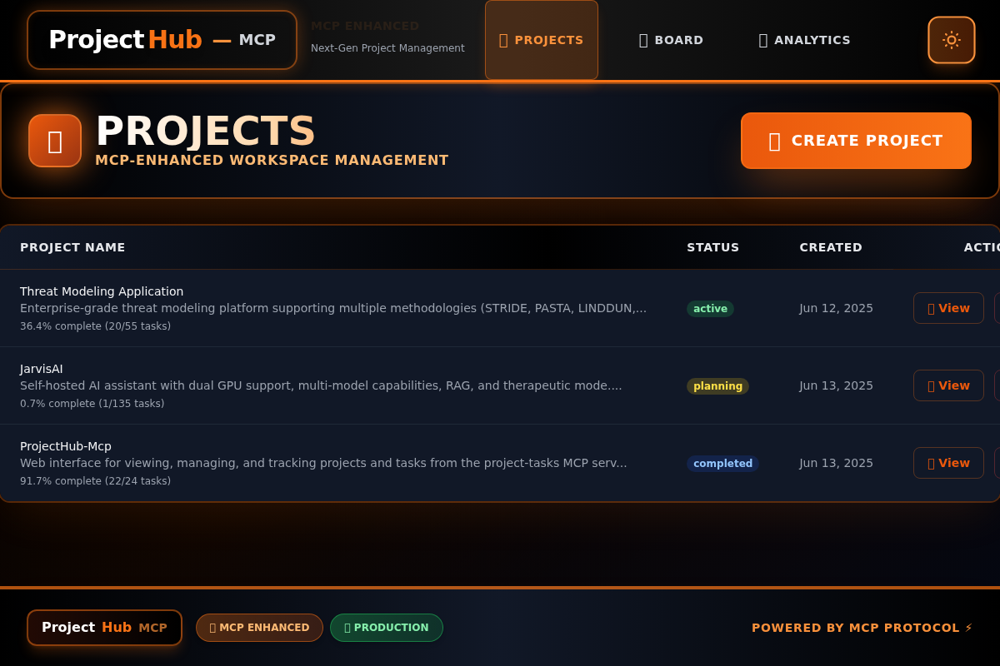
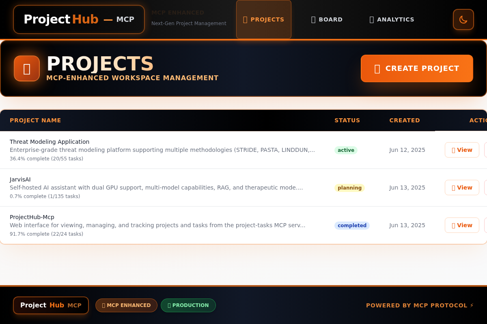

# 🎨 ProjectHub — MCP User Interface Overview

<div align="center">


### Experience the dramatic black/orange branding and modern UI design

</div>

---

**ProjectHub — MCP** provides a stunning, modern interface with dramatic black/orange branding designed for efficient enterprise project management. This guide showcases all major UI components and the visual design philosophy.

## 🌟 Visual Design Philosophy

### 🎨 Color Scheme & Branding
- **Primary Black**: `#0a0a0a` - Deep, professional background
- **Vibrant Orange**: `#ff6500` - Interactive elements and accents  
- **Gradient Effects**: Smooth dark-to-orange transitions
- **High Contrast**: Accessibility-focused typography for enterprise use

### ✨ Interactive Elements
- **Glowing Effects**: Orange accents that glow on hover
- **Smooth Animations**: Fluid transitions between UI states
- **Card-based Layout**: Modern, clean component design
- **Responsive Design**: Adapts beautifully to all screen sizes

## 📸 Interface Screenshots

<div align="center">

### 🏠 Homepage with Dark Theme


*Professional black background with orange navigation accents*

### 📋 Kanban Board Interface  


*Drag-and-drop task management with visual progress tracking*

### 📊 Projects Overview


*Clean project listing with statistics and quick actions*

### 🌓 Theme Comparison
<table>
<tr>
<td align="center"><strong>🌙 Dark Mode (Default)</strong></td>
<td align="center"><strong>☀️ Light Mode</strong></td>
</tr>
<tr>
<td></td>
<td></td>
</tr>
<tr>
<td align="center"><em>Dramatic black/orange enterprise theme</em></td>
<td align="center"><em>Clean light alternative</em></td>
</tr>
</table>

</div>

## 🏠 Main Navigation

### Top Navigation Bar
The primary navigation contains:
- **Logo/Brand**: Returns to home/project list
- **Projects**: View all projects
- **Board**: Quick access to Kanban boards
- **Analytics**: Project performance insights
- **Theme Toggle**: Switch between light and dark mode
- **User Menu**: Settings and account options

### Breadcrumb Navigation
Dynamic breadcrumbs show your current location:
```
Projects > task-management-webui > Board View
```

## 📊 Project Views

The application offers four distinct views for managing tasks:

### 1. Kanban Board View
**Purpose**: Visual workflow management with drag-and-drop

**Features**:
- **Columns**: Pending, In Progress, Blocked, Testing, Completed
- **Task Cards**: Show title, priority, assignee, due date
- **Drag & Drop**: Move tasks between status columns
- **Quick Actions**: Edit, delete, view details
- **Filters**: Status, priority, assignee, date range

**Best For**: Agile workflows, visual task tracking, team collaboration

### 2. List View
**Purpose**: Detailed tabular view of all tasks

**Features**:
- **Sortable Columns**: Click headers to sort by any field
- **Bulk Selection**: Select multiple tasks for batch operations
- **Inline Editing**: Quick edit task properties
- **Advanced Filters**: Complex filtering combinations
- **Export Options**: CSV, JSON, PDF formats

**Best For**: Detailed task management, bulk operations, reporting

### 3. Calendar View
**Purpose**: Time-based task scheduling and deadline management

**Features**:
- **Monthly View**: See tasks distributed across calendar days
- **Color Coding**: Tasks colored by status/priority
- **Date Navigation**: Jump to specific months/years
- **Task Tooltips**: Hover to see task details
- **Multi-task Days**: Shows multiple tasks per day

**Best For**: Deadline tracking, schedule planning, time management

### 4. Timeline/Gantt View
**Purpose**: Project timeline and dependency visualization

**Features**:
- **Timeline Bars**: Visual representation of task duration
- **Dependencies**: See task relationships and blockers
- **Milestone Markers**: Important project milestones
- **Resource Allocation**: View assignee workloads
- **Zoom Controls**: Adjust timeline granularity

**Best For**: Project planning, dependency management, resource allocation

## 🎛️ Control Panel

### View Switcher
Quick buttons to change between views:
```
[Board] [List] [Calendar] [Timeline]
```

### Action Buttons
- **New Task**: Create new task in current project
- **Templates**: Use predefined task templates
- **Analytics**: Jump to project analytics
- **Export**: Export project data
- **Filters**: Open advanced filtering panel

### Search and Filters
**Global Search**:
- Search across task names, descriptions, notes
- Real-time results as you type
- Keyboard shortcut: `Ctrl+K` (or `Cmd+K` on Mac)

**Filter Panel**:
- **Status**: Pending, In Progress, Blocked, Testing, Completed
- **Priority**: Low, Medium, High, Critical
- **Assignee**: Filter by team member
- **Date Range**: Start date, due date, created date
- **Tags**: Custom task labels
- **Dependencies**: Tasks with/without dependencies

## 🃏 Task Cards & Details

### Task Card Layout
```
┌─────────────────────────────────┐
│ [Priority] Task Title           │
│ 📝 Short description...         │
│ 👤 John Doe  📅 Due: Jun 15    │
│ 🏷️ frontend, bug              │
└─────────────────────────────────┘
```

### Task Detail Modal
Click any task to open detailed view:

**Header Section**:
- Task title (editable)
- Status dropdown
- Priority selector
- Assignee picker

**Body Sections**:
- **Description**: Rich text with markdown support
- **Comments**: Threaded discussion with mentions
- **Attachments**: File uploads with preview
- **Dependencies**: Linked tasks and blockers
- **Time Tracking**: Pomodoro timer and logged hours
- **Activity**: Audit trail of all changes

**Footer Actions**:
- Save changes
- Delete task
- Clone task
- Convert to subtask

## 🎨 Theme and Accessibility

### Dark Mode
Toggle between light and dark themes:
- **Light Theme**: Clean, bright interface for daytime use
- **Dark Theme**: Easy on eyes for low-light environments
- **System**: Automatically follow OS preference

### Accessibility Features
- **Keyboard Navigation**: Full keyboard support
- **Screen Reader**: ARIA labels and semantic HTML
- **High Contrast**: Excellent color contrast ratios
- **Font Scaling**: Respects browser font size settings
- **Focus Indicators**: Clear focus outlines

## 📱 Responsive Design

### Desktop Layout (1200px+)
- Full sidebar navigation
- Multi-column layouts
- Advanced filtering panels
- Keyboard shortcuts displayed

### Tablet Layout (768px - 1199px)
- Collapsible sidebar
- Responsive grid layouts
- Touch-optimized controls
- Swipe gestures

### Mobile Layout (< 768px)
- Bottom navigation
- Full-screen modals
- Pull-to-refresh
- Mobile-optimized forms

## 🔄 Real-time Updates

### Live Sync Features
- **Task Updates**: See changes from other users instantly
- **Status Changes**: Real-time board updates
- **New Comments**: Instant comment notifications
- **User Presence**: See who's currently online
- **Conflict Resolution**: Handle simultaneous edits

### Visual Indicators
- **Pulse Animation**: Indicates real-time updates
- **Change Highlighting**: Recently modified items highlighted
- **Connection Status**: Online/offline indicator
- **Sync Status**: Data synchronization progress

## ⚡ Performance Features

### Loading States
- **Skeleton Screens**: Smooth loading placeholders
- **Progressive Loading**: Load critical content first
- **Lazy Loading**: Load images and heavy content on demand
- **Infinite Scroll**: Seamless pagination

### Offline Support
- **Cached Data**: Work with previously loaded data
- **Offline Indicator**: Clear offline status
- **Sync Queue**: Changes sync when connection restored
- **Conflict Resolution**: Handle offline/online conflicts

## 🎯 Quick Actions

### Keyboard Shortcuts
| Shortcut | Action |
|----------|--------|
| `Ctrl+K` | Global search |
| `N` | New task |
| `B` | Switch to board view |
| `L` | Switch to list view |
| `C` | Switch to calendar view |
| `T` | Switch to timeline view |
| `F` | Focus filter panel |
| `Esc` | Close modals/panels |
| `?` | Show help dialog |

### Context Menus
Right-click on tasks for quick actions:
- Edit task
- Change status
- Set priority
- Assign to user
- Add to template
- Duplicate task
- Delete task

### Bulk Operations
Select multiple tasks (Ctrl+click) for:
- Bulk status change
- Bulk assignee change
- Bulk priority update
- Bulk delete
- Export selected
- Add to template

## 📊 Status Indicators

### Task Status Colors
- **Pending**: Gray - Not started
- **In Progress**: Blue - Currently being worked on
- **Blocked**: Red - Cannot proceed due to dependencies
- **Testing**: Yellow - In review/testing phase
- **Completed**: Green - Successfully finished

### Priority Indicators
- **Low**: No special indicator
- **Medium**: Blue dot
- **High**: Orange exclamation
- **Critical**: Red warning triangle

### Visual Cues
- **Overdue Tasks**: Red border/background
- **Due Today**: Yellow highlight
- **Recently Updated**: Subtle glow effect
- **Has Comments**: Comment bubble icon
- **Has Attachments**: Paperclip icon

---

<div align="center">

### 🚀 Ready to Experience ProjectHub — MCP?

[](Installation-Guide)
[](http://localhost:5173)

**Next**: Learn about [Task Management](Task-Management) workflows and best practices.

---


*Built with ❤️ and ☕ by [@anubissbe](https://github.com/anubissbe)*

</div>